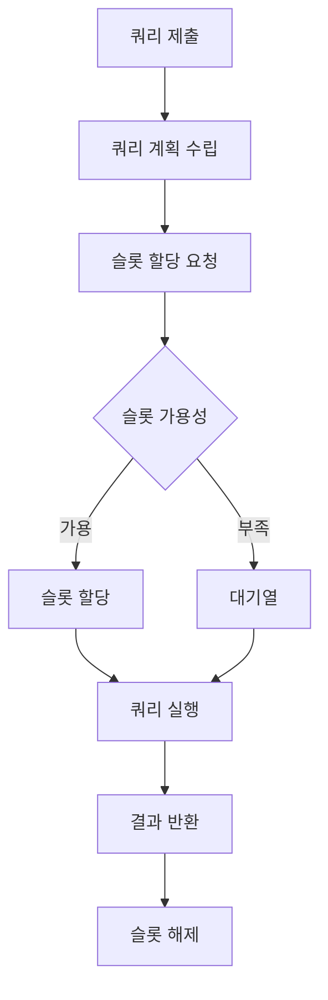

BigQuery 슬롯(Slot)에 대한 종합적인 이해와 활용 방법을 다루는 가이드입니다.

---

## 목차

1. [슬롯 개념과 정의](#1-슬롯-개념과-정의)
2. [슬롯 작동 원리](#2-슬롯-작동-원리)
3. [슬롯 종류와 특징](#3-슬롯-종류와-특징)
4. [슬롯 관리 및 할당](#4-슬롯-관리-및-할당)
5. [슬롯 모니터링](#5-슬롯-모니터링)
6. [슬롯 최적화 전략](#6-슬롯-최적화-전략)
7. [실제 사용 사례](#7-실제-사용-사례)
8. [문제 해결 가이드](#8-문제-해결-가이드)

---

## 1. 슬롯 개념과 정의

### 1.1 슬롯이란?

**BigQuery 슬롯(Slot)**은 쿼리를 실행하는 데 필요한 **가상 CPU 단위**입니다.

- **기본 개념**: 쿼리 처리를 위한 연산 리소스의 최소 단위
- **병렬 처리**: 복잡한 쿼리는 여러 슬롯을 동시에 사용하여 병렬 처리
- **리소스 격리**: 각 슬롯은 독립적인 처리 단위로 작동

### 1.2 슬롯의 중요성

```
쿼리 성능 = 할당된 슬롯 수 × 쿼리 복잡도 × 데이터 크기
```

- **성능 보장**: 예약된 슬롯만큼의 처리 능력 보장
- **리소스 예측**: 워크로드에 따른 필요 슬롯 수 예측 가능
- **비용 관리**: 슬롯 기반 요금제로 비용 예측성 확보

### 1.3 슬롯 vs 다른 리소스

| 구분 | 슬롯 | 메모리 | 스토리지 |
|------|------|--------|----------|
| **역할** | 연산 처리 | 임시 데이터 저장 | 영구 데이터 저장 |
| **단위** | 개수 (1 슬롯 = 1 vCPU) | GB | TB |
| **할당 방식** | 동적/예약 | 자동 | 사용량 기반 |

---

## 2. 슬롯 작동 원리

### 2.1 쿼리 실행 과정



### 2.2 슬롯 할당 메커니즘

#### 온디맨드 슬롯
- **공유 풀**: Google이 관리하는 공용 슬롯 풀 사용
- **동적 할당**: 쿼리 실행 시점에 필요한 만큼 할당
- **최대 한도**: 프로젝트당 기본 2,000 슬롯 제한

#### 예약 슬롯
- **전용 할당**: 특정 프로젝트/조직에 전용 할당
- **고정 성능**: 예약한 슬롯만큼 항상 보장
- **우선 순위**: 온디맨드보다 높은 우선순위

### 2.3 슬롯 스케줄링

```sql
-- 쿼리 우선순위 설정 예시
SELECT *
FROM `project.dataset.table`
WHERE condition = true
-- 실행 시 슬롯 우선순위: INTERACTIVE > BATCH
```

#### 우선순위 레벨
1. **INTERACTIVE** (기본값): 즉시 실행, 높은 우선순위
2. **BATCH**: 지연 실행 허용, 낮은 우선순위

---

## 3. 슬롯 종류와 특징

### 3.1 온디맨드 슬롯

#### 특징
- **즉석 사용**: 필요시 즉시 할당
- **공유 리소스**: 다른 사용자와 슬롯 풀 공유
- **변동 성능**: 가용 슬롯에 따라 성능 변동 가능

#### 적합한 경우
- 불규칙한 워크로드
- 소규모 프로젝트
- 개발/테스트 환경

### 3.2 예약 슬롯 (Committed Use)

#### Flex 슬롯
```bash
# Flex 슬롯 생성 예시
bq mk --reservation --project_id=PROJECT_ID \
  --location=US --slots=100 --ignore_idle_slots=false \
  my-flex-reservation
```

- **최소 약정**: 60초
- **유연한 확장**: 필요시 즉시 확장/축소
- **시간당 과금**: 사용한 시간만큼만 과금

#### 월간/연간 약정 슬롯
```bash
# 연간 약정 슬롯 생성
bq mk --reservation --project_id=PROJECT_ID \
  --location=US --slots=500 --plan=ANNUAL \
  production-reservation
```

- **장기 약정**: 1개월 또는 1년
- **할인 혜택**: 장기 약정 시 더 많은 할인
- **안정적 성능**: 보장된 슬롯으로 일정한 성능

### 3.3 에디션별 슬롯 특징

#### Standard Edition
- **기본 기능**: 표준 BigQuery 기능 제공
- **슬롯 성능**: 1 슬롯 = 1 vCPU
- **메모리**: 슬롯당 기본 메모리 할당

#### Enterprise Edition
- **고급 기능**: 고급 보안, 거버넌스 기능
- **향상된 성능**: 더 많은 메모리, 네트워크 대역폭
- **우선 지원**: 전담 지원팀 제공

---

## 4. 슬롯 관리 및 할당

### 4.1 슬롯 예약 생성

#### CLI를 통한 예약 생성
```bash
# 기본 예약 생성
bq mk --reservation \
  --project_id=my-project \
  --location=US \
  --slots=1000 \
  --plan=FLEX \
  my-reservation

# 자동 스케일링 설정
bq mk --reservation \
  --project_id=my-project \
  --location=US \
  --slots=500 \
  --max_slots=2000 \
  --autoscale_max_slots=2000 \
  auto-scaling-reservation
```

#### 웹 콘솔을 통한 관리
1. BigQuery 콘솔 → Reservations
2. Create Reservation 클릭
3. 필요한 설정값 입력
4. Commitment 타입 선택

### 4.2 할당(Assignment) 관리

#### 프로젝트별 할당
```bash
# 특정 프로젝트에 예약 할당
bq mk --assignment \
  --reservation_id=projects/my-project/locations/US/reservations/my-reservation \
  --job_type=QUERY \
  --assignee_id=projects/assigned-project \
  --assignee_type=PROJECT
```

#### 폴더/조직 단위 할당
```bash
# 폴더 단위 할당
bq mk --assignment \
  --reservation_id=projects/my-project/locations/US/reservations/my-reservation \
  --job_type=QUERY \
  --assignee_id=folders/123456789 \
  --assignee_type=FOLDER
```

### 4.3 할당 우선순위

1. **프로젝트 할당**: 가장 높은 우선순위
2. **폴더 할당**: 중간 우선순위  
3. **조직 할당**: 가장 낮은 우선순위
4. **온디맨드**: 할당이 없는 경우

---

## 5. 슬롯 모니터링

### 5.1 슬롯 사용량 모니터링

#### INFORMATION_SCHEMA를 활용한 모니터링
```sql
-- 실시간 슬롯 사용량 조회
SELECT reservation_name
     , total_slots
     , assigned_slots
     , idle_slots
     , total_assigned_slots - assigned_slots AS available_slots
FROM `region-US`.INFORMATION_SCHEMA.RESERVATIONS_TIMELINE
WHERE creation_time >= TIMESTAMP_SUB(CURRENT_TIMESTAMP(), INTERVAL 1 HOUR)
ORDER BY creation_time DESC;
```

#### 쿼리별 슬롯 사용량
```sql
-- 지난 24시간 동안 쿼리별 슬롯 사용량
SELECT job_id
     , user_email
     , query
     , total_slot_ms
     , total_slot_ms / 1000 / 60 AS slot_minutes
     , start_time
     , end_time
FROM `region-US`.INFORMATION_SCHEMA.JOBS_BY_USER
WHERE creation_time >= TIMESTAMP_SUB(CURRENT_TIMESTAMP(), INTERVAL 24 HOUR)
  AND total_slot_ms > 0
ORDER BY total_slot_ms DESC
LIMIT 100;
```

### 5.2 Cloud Monitoring 활용

#### 커스텀 대시보드 생성
```yaml
# monitoring-dashboard.yaml
displayName: "BigQuery 슬롯 모니터링"
mosaicLayout:
  tiles:
  - width: 6
    height: 4
    widget:
      title: "슬롯 사용률"
      xyChart:
        dataSets:
        - timeSeriesQuery:
            timeSeriesFilter:
              filter: 'resource.type="bigquery_reservation"'
              metricFilter:
                metricType: "bigquery.googleapis.com/slots/total_allocated"
```

#### 알림 설정
```bash
# 슬롯 사용률 80% 초과 시 알림
gcloud alpha monitoring policies create \
  --notification-channels=NOTIFICATION_CHANNEL_ID \
  --display-name="BigQuery 슬롯 사용률 알림" \
  --condition-filter='resource.type="bigquery_reservation"' \
  --condition-comparison=COMPARISON_GREATER_THAN \
  --condition-threshold-value=0.8
```

### 5.3 성능 메트릭 분석

#### 핵심 메트릭
- **슬롯 사용률**: (사용 중인 슬롯 / 총 할당 슬롯) × 100
- **평균 대기 시간**: 쿼리 실행 전 대기 시간
- **처리량**: 시간당 완료된 쿼리 수
- **비용 효율성**: 슬롯 시간당 처리된 데이터양

---

## 6. 슬롯 최적화 전략

### 6.1 쿼리 최적화

#### 효율적인 쿼리 작성
```sql
-- 비효율적인 쿼리 (피해야 할 패턴)
SELECT *
FROM large_table t1
         JOIN another_large_table t2 ON t1.id = t2.id
WHERE t1.date_column BETWEEN '2023-01-01' AND '2023-12-31';

-- 최적화된 쿼리
SELECT t1.id
     , t1.column1
     , t2.column2
FROM large_table t1
         JOIN another_large_table t2 ON t1.id = t2.id
WHERE t1.date_column BETWEEN '2023-01-01' AND '2023-12-31'
  AND t1._PARTITIONTIME BETWEEN TIMESTAMP('2023-01-01') AND TIMESTAMP('2023-12-31');
```

#### 파티셔닝 활용
```sql
-- 파티션 테이블 생성
CREATE TABLE `project.dataset.partitioned_table`
(
    id INT64,
    name         STRING,
    created_date DATE
) PARTITION BY created_date
CLUSTER BY id;
```

### 6.2 슬롯 할당 최적화

#### 동적 슬롯 관리
```python
# Python을 활용한 동적 슬롯 관리
from google.cloud import bigquery_reservation_v1
from google.cloud import monitoring_v3
import datetime

def adjust_slots_based_on_usage():
    client = bigquery_reservation_v1.ReservationServiceClient()
    monitoring_client = monitoring_v3.MetricServiceClient()
    
    # 현재 사용률 조회
    current_usage = get_current_slot_usage(monitoring_client)
    
    if current_usage > 0.8:  # 80% 초과 시
        # 슬롯 증가
        increase_slots(client, increase_by=200)
    elif current_usage < 0.3:  # 30% 미만 시
        # 슬롯 감소
        decrease_slots(client, decrease_by=100)

def get_current_slot_usage(client):
    # 모니터링 API를 통한 사용률 조회 로직
    pass
```

#### 워크로드별 예약 전략
```bash
# ETL 워크로드용 예약
bq mk --reservation \
  --slots=1000 \
  --plan=FLEX \
  etl-reservation

# 애드혹 분석용 예약  
bq mk --reservation \
  --slots=500 \
  --plan=FLEX \
  analytics-reservation

# 대시보드용 예약
bq mk --reservation \
  --slots=200 \
  --plan=MONTHLY \
  dashboard-reservation
```

### 6.3 비용 최적화

#### 슬롯 공유 전략
```sql
-- 조직 내 슬롯 사용량 분석
WITH slot_usage AS (SELECT project_id
                         , reservation_name
                         , SUM(total_slot_ms) / 1000 / 60 / 60 AS slot_hours
                         , COUNT(*)                            AS query_count
                    FROM `region-US`.INFORMATION_SCHEMA.JOBS_BY_ORGANIZATION
                    WHERE creation_time >= TIMESTAMP_SUB(CURRENT_TIMESTAMP(), INTERVAL 7 DAY)
                      AND reservation_name IS NOT NULL
                    GROUP BY project_id, reservation_name)
SELECT project_id
     , reservation_name
     , slot_hours
     , query_count
     , slot_hours / query_count AS avg_slot_hours_per_query
FROM slot_usage
ORDER BY slot_hours DESC;
```

#### 유휴 슬롯 최소화
- **자동 스케일링**: 필요에 따라 자동으로 슬롯 조정
- **스케줄 기반 조정**: 시간대별 워크로드에 맞춰 슬롯 조정
- **예약 통합**: 여러 작은 예약을 큰 예약으로 통합

---

## 7. 실제 사용 사례

### 7.1 대규모 ETL 파이프라인

#### 시나리오
- **데이터량**: 일일 100TB 처리
- **처리 시간**: 2시간 내 완료 필요
- **워크로드**: 매일 새벽 2시~4시 집중

#### 최적 구성
```bash
# ETL 전용 대용량 예약
bq mk --reservation \
  --project_id=etl-project \
  --location=US \
  --slots=2000 \
  --plan=FLEX \
  --ignore_idle_slots=false \
  etl-night-batch

# 스케줄 기반 슬롯 조정 (Cloud Scheduler + Cloud Functions)
```

#### 예상 성능
- **처리 속도**: 2000 슬롯으로 약 50TB/시간
- **완료 시간**: 2시간 내 100TB 처리 가능
- **비용**: Flex 슬롯으로 사용 시간만큼만 과금

### 7.2 실시간 대시보드

#### 시나리오  
- **쿼리 특성**: 짧고 빈번한 쿼리
- **응답 시간**: 5초 이내 필요
- **사용 패턴**: 업무 시간 중 집중 사용

#### 최적 구성
```bash
# 실시간 대시보드용 월간 약정
bq mk --reservation \
  --project_id=dashboard-project \
  --location=US \
  --slots=300 \
  --plan=MONTHLY \
  dashboard-realtime

# 높은 우선순위 설정
bq query --use_legacy_sql=false \
  --priority=INTERACTIVE \
  --reservation=dashboard-realtime \
  "SELECT * FROM dashboard_view LIMIT 1000"
```

### 7.3 머신러닝 워크로드

#### 시나리오
- **모델 훈련**: 대용량 피처 엔지니어링
- **배치 예측**: 일괄 예측 작업
- **실험**: 여러 모델 동시 실험

#### 최적 구성
```sql
-- ML 훈련용 예약 할당
CREATE OR REPLACE MODEL `ml_project.models.customer_segmentation`
OPTIONS(
  model_type='KMEANS',
  num_clusters=5,
  reservation='ml-training-reservation'
) AS
SELECT customer_id
     , feature1
     , feature2
     , feature3
FROM `ml_project.features.customer_features`;
```

---

## 8. 문제 해결 가이드

### 8.1 일반적인 문제

#### 슬롯 부족 (Slot Shortage)
**증상**
- 쿼리 대기 시간 증가
- "Exceeded limit for concurrent queries" 오류

**해결 방법**
```bash
# 1. 현재 슬롯 사용량 확인
bq ls --reservations --location=US

# 2. 슬롯 증가 (Flex 예약인 경우)
bq update --reservation \
  --location=US \
  --slots=1500 \
  my-reservation

# 3. 추가 예약 구매 고려
```

#### 슬롯 유휴 상태 (Idle Slots)
**증상**
- 높은 슬롯 비용 대비 낮은 활용률
- 대부분 시간에 슬롯 미사용

**해결 방법**
```python
# 자동 슬롯 조정 스크립트
def optimize_slot_allocation():
    # 지난 7일간 사용 패턴 분석
    usage_data = analyze_slot_usage_pattern()
    
    # 사용률이 30% 미만인 시간대 식별
    low_usage_periods = identify_low_usage_periods(usage_data)
    
    # 해당 시간대에 슬롯 감소
    for period in low_usage_periods:
        schedule_slot_reduction(period)
```

### 8.2 성능 최적화 문제

#### 쿼리 성능 저하
**진단 쿼리**
```sql
-- 슬롯 사용 효율성 분석
SELECT
  job_id,
  query,
  total_slot_ms,
  total_bytes_processed,
  (total_slot_ms / 1000) / (total_bytes_processed / POW(2, 30)) AS slot_seconds_per_gb
FROM `region-US`.INFORMATION_SCHEMA.JOBS_BY_USER
WHERE
  creation_time >= TIMESTAMP_SUB(CURRENT_TIMESTAMP(), INTERVAL 24 HOUR)
  AND total_slot_ms > 0
ORDER BY slot_seconds_per_gb DESC
LIMIT 20;
```

**최적화 방법**
1. **쿼리 재작성**: 불필요한 JOIN, 서브쿼리 제거
2. **파티션 프루닝**: WHERE 절에 파티션 컬럼 포함
3. **컬럼 선택**: SELECT *보다 필요한 컬럼만 선택

#### 할당 충돌 문제
**증상**
- 여러 프로젝트가 동일한 예약을 사용할 때 충돌
- 우선순위가 높은 작업이 리소스 독점

**해결 방법**
```bash
# 워크로드별 별도 예약 생성
bq mk --reservation --slots=500 high-priority-reservation
bq mk --reservation --slots=300 medium-priority-reservation
bq mk --reservation --slots=200 low-priority-reservation

# 각각 다른 프로젝트에 할당
bq mk --assignment \
  --reservation_id=projects/my-project/locations/US/reservations/high-priority-reservation \
  --assignee_id=projects/critical-project \
  --assignee_type=PROJECT
```

### 8.3 비용 관련 문제

#### 예상보다 높은 비용
**원인 분석**
```sql
-- 일일 슬롯 비용 추이
SELECT DATE(usage_start_time)        as usage_date
     , reservation_name
     , SUM(slot_ms) / 1000 / 60 / 60 AS total_slot_hours
     , total_slot_hours * 0.04       AS estimated_cost_usd -- Flex 슬롯 시간당 약 $0.04
FROM `region-US`.INFORMATION_SCHEMA.RESERVATION_USAGE
WHERE usage_start_time >= TIMESTAMP_SUB(CURRENT_TIMESTAMP(), INTERVAL 30 DAY)
GROUP BY usage_date, reservation_name
ORDER BY usage_date DESC, estimated_cost_usd DESC;
```

**비용 절감 전략**
1. **약정 전환**: Flex → 월간/연간 약정으로 전환 시 할인
2. **사용 패턴 분석**: 피크 시간대 식별 후 스케줄링 조정
3. **리소스 통합**: 여러 작은 예약을 하나의 큰 예약으로 통합

---

## 마무리

BigQuery 슬롯은 성능과 비용을 함께 관리할 수 있는 핵심 리소스입니다. 

### 핵심 요약
- **개념 이해**: 슬롯 = 쿼리 처리를 위한 가상 CPU 단위
- **종류 선택**: 워크로드 패턴에 따른 적절한 슬롯 유형 선택
- **모니터링**: 지속적인 사용량 및 성능 모니터링 필수
- **최적화**: 쿼리 최적화와 슬롯 할당 최적화 병행

### 베스트 프랙티스
1. **점진적 접근**: 작은 규모부터 시작하여 점진적 확장
2. **지속적 모니터링**: 정기적인 사용 패턴 분석 및 조정
3. **워크로드 분리**: 서로 다른 워크로드는 별도 예약으로 관리
4. **비용 최적화**: 사용 패턴 기반 약정 타입 선택

---

*최종 업데이트: 2025년 1월*