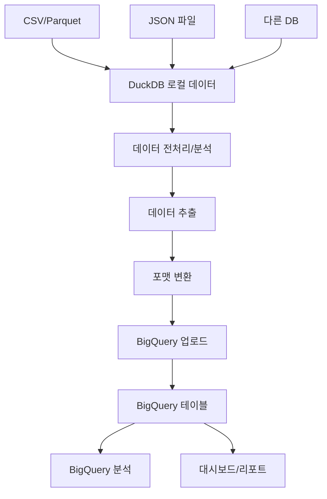

DuckDB에서 BigQuery로 데이터를 이관하고 연동하는 방법을 다루는 종합 가이드입니다.

---

## 목차

1. [DuckDB-BigQuery 연동 개요](#1-duckdb-bigquery-연동-개요)
2. [DuckDB 개요 및 특징](#2-duckdb-개요-및-특징)
3. [연동 방법론](#3-연동-방법론)
4. [Python을 통한 데이터 이관](#4-python을-통한-데이터-이관)
5. [대용량 데이터 처리 전략](#5-대용량-데이터-처리-전략)
6. [성능 최적화](#6-성능-최적화)
7. [실제 활용 사례](#7-실제-활용-사례)
8. [모범 사례](#8-모범-사례)

---

## 1. DuckDB-BigQuery 연동 개요

### 1.1 연동의 필요성

**DuckDB**는 분석용 인메모리 데이터베이스로, 로컬 데이터 처리에 뛰어난 성능을 제공합니다. **BigQuery**는 클라우드 기반 대규모 데이터 웨어하우스로, 페타바이트급 데이터 분석이 가능합니다.

### 1.2 주요 사용 시나리오

- **로컬 데이터 분석 후 클라우드 이관**: DuckDB에서 전처리한 데이터를 BigQuery로 이관
- **하이브리드 분석**: 로컬과 클라우드 환경을 결합한 데이터 파이프라인
- **데이터 마이그레이션**: 기존 로컬 데이터베이스를 BigQuery로 이전
- **프로토타이핑**: DuckDB에서 분석 로직 개발 후 BigQuery에서 확장

### 1.3 연동 장점

- **개발 효율성**: 로컬 환경에서 빠른 프로토타이핑
- **비용 최적화**: 필요한 데이터만 BigQuery로 이관
- **성능 향상**: 각 환경의 장점을 활용한 최적화

---

## 2. DuckDB 개요 및 특징

### 2.1 DuckDB란?

**DuckDB**는 분석 워크로드에 특화된 임베디드 SQL OLAP 데이터베이스 관리 시스템입니다.

### 2.2 주요 특징

- **컬럼형 저장**: 분석 쿼리에 최적화
- **임베디드**: 별도 서버 없이 애플리케이션에 내장
- **SQL 호환**: 표준 SQL 지원
- **다양한 포맷 지원**: CSV, Parquet, JSON 등

### 2.3 설치 및 기본 설정

```python
# DuckDB 설치
pip install duckdb

# 기본 사용법
import duckdb

# 인메모리 데이터베이스 생성
conn = duckdb.connect(':memory:')

# 파일 기반 데이터베이스 생성
conn = duckdb.connect('my_database.duckdb')

# 간단한 쿼리 실행
result = conn.execute("SELECT 'Hello DuckDB' as message").fetchall()
print(result)
```

### 2.4 데이터 로드 예제

```python
import duckdb
import pandas as pd

# CSV 파일 직접 쿼리
conn = duckdb.connect()
result = conn.execute("SELECT * FROM 'data.csv' LIMIT 10").fetchdf()

# Pandas DataFrame과 연동
df = pd.read_csv('data.csv')
conn.register('my_table', df)
result = conn.execute("SELECT COUNT(*) FROM my_table").fetchall()

# Parquet 파일 쿼리
result = conn.execute("SELECT * FROM 'data.parquet'").fetchdf()
```

---

## 3. 연동 방법론

### 3.1 연동 아키텍처



### 3.2 지원하는 데이터 형식

| 형식 | DuckDB 지원 | BigQuery 지원 | 권장도 |
|------|------------|---------------|--------|
| CSV | ✅ | ✅ | ⭐⭐⭐ |
| Parquet | ✅ | ✅ | ⭐⭐⭐⭐⭐ |
| JSON | ✅ | ✅ | ⭐⭐⭐⭐ |
| JSONL | ✅ | ✅ | ⭐⭐⭐⭐ |
| ORC | ✅ | ✅ | ⭐⭐⭐ |

### 3.3 데이터 타입 매핑

| DuckDB 타입 | BigQuery 타입 | 참고사항 |
|------------|---------------|---------|
| INTEGER | INT64 | |
| BIGINT | INT64 | |
| DOUBLE | FLOAT64 | |
| VARCHAR | STRING | |
| BOOLEAN | BOOL | |
| DATE | DATE | |
| TIMESTAMP | TIMESTAMP | 타임존 주의 |
| JSON | JSON | BigQuery 네이티브 JSON |

---

## 4. Python을 통한 데이터 이관

### 4.1 환경 설정

```python
# 필요한 라이브러리 설치
pip install duckdb google-cloud-bigquery pandas pyarrow

# 라이브러리 임포트
import duckdb
from google.cloud import bigquery
import pandas as pd
import pyarrow as pa
import pyarrow.parquet as pq
from datetime import datetime
```

### 4.2 기본 이관 스크립트

```python
import duckdb
from google.cloud import bigquery
import pandas as pd

class DuckDBToBigQuery:
    def __init__(self, bigquery_project_id, bigquery_dataset_id):
        self.duckdb_conn = duckdb.connect(':memory:')
        self.bq_client = bigquery.Client(project=bigquery_project_id)
        self.project_id = bigquery_project_id
        self.dataset_id = bigquery_dataset_id
        
    def load_data_to_duckdb(self, file_path, table_name):
        """파일을 DuckDB에 로드"""
        if file_path.endswith('.csv'):
            query = f"CREATE TABLE {table_name} AS SELECT * FROM '{file_path}'"
        elif file_path.endswith('.parquet'):
            query = f"CREATE TABLE {table_name} AS SELECT * FROM '{file_path}'"
        elif file_path.endswith('.json'):
            query = f"CREATE TABLE {table_name} AS SELECT * FROM read_json_auto('{file_path}')"
        else:
            raise ValueError("지원하지 않는 파일 형식입니다.")
        
        self.duckdb_conn.execute(query)
        print(f"데이터가 DuckDB 테이블 '{table_name}'에 로드되었습니다.")
    
    def transform_data(self, source_table, target_table, transform_query):
        """DuckDB에서 데이터 변환"""
        query = f"CREATE TABLE {target_table} AS {transform_query}"
        self.duckdb_conn.execute(query)
        print(f"변환된 데이터가 테이블 '{target_table}'에 저장되었습니다.")
    
    def migrate_to_bigquery(self, duckdb_table, bigquery_table, batch_size=10000):
        """DuckDB에서 BigQuery로 데이터 이관"""
        # DuckDB에서 데이터 추출
        df = self.duckdb_conn.execute(f"SELECT * FROM {duckdb_table}").fetchdf()
        
        # BigQuery 테이블 참조
        table_ref = f"{self.project_id}.{self.dataset_id}.{bigquery_table}"
        
        # 배치별로 업로드
        total_rows = len(df)
        for i in range(0, total_rows, batch_size):
            batch_df = df.iloc[i:i+batch_size]
            
            # BigQuery에 데이터 로드
            job_config = bigquery.LoadJobConfig()
            job_config.write_disposition = bigquery.WriteDisposition.WRITE_APPEND
            
            job = self.bq_client.load_table_from_dataframe(
                batch_df, table_ref, job_config=job_config
            )
            job.result()  # 작업 완료 대기
            
            print(f"배치 {i//batch_size + 1} 완료: {min(i+batch_size, total_rows)}/{total_rows} 행")
        
        print(f"모든 데이터가 BigQuery 테이블 '{bigquery_table}'에 이관되었습니다.")

# 사용 예제
migrator = DuckDBToBigQuery('your-project-id', 'your-dataset')

# 1. 데이터 로드
migrator.load_data_to_duckdb('sales_data.csv', 'raw_sales')

# 2. 데이터 변환
transform_query = """
    SELECT 
        customer_id,
        product_name,
        quantity,
        price,
        quantity * price as total_amount,
        DATE(order_date) as order_date,
        EXTRACT(YEAR FROM order_date) as order_year,
        EXTRACT(MONTH FROM order_date) as order_month
    FROM raw_sales 
    WHERE quantity > 0 AND price > 0
"""
migrator.transform_data('raw_sales', 'processed_sales', transform_query)

# 3. BigQuery로 이관
migrator.migrate_to_bigquery('processed_sales', 'sales_analysis')
```

### 4.3 고급 이관 스크립트

```python
import json
from typing import Dict, List, Optional

class AdvancedDuckDBToBigQuery:
    def __init__(self, bigquery_project_id: str, bigquery_dataset_id: str):
        self.duckdb_conn = duckdb.connect(':memory:')
        self.bq_client = bigquery.Client(project=bigquery_project_id)
        self.project_id = bigquery_project_id
        self.dataset_id = bigquery_dataset_id
        
    def analyze_duckdb_schema(self, table_name: str) -> Dict:
        """DuckDB 테이블 스키마 분석"""
        query = f"DESCRIBE {table_name}"
        schema_info = self.duckdb_conn.execute(query).fetchall()
        
        schema = {}
        for column_name, column_type, null, key, default, extra in schema_info:
            schema[column_name] = {
                'type': column_type,
                'nullable': null == 'YES',
                'bigquery_type': self._map_type_to_bigquery(column_type)
            }
        
        return schema
    
    def _map_type_to_bigquery(self, duckdb_type: str) -> str:
        """DuckDB 타입을 BigQuery 타입으로 매핑"""
        type_mapping = {
            'INTEGER': 'INT64',
            'BIGINT': 'INT64',
            'DOUBLE': 'FLOAT64',
            'VARCHAR': 'STRING',
            'BOOLEAN': 'BOOL',
            'DATE': 'DATE',
            'TIMESTAMP': 'TIMESTAMP',
            'JSON': 'JSON'
        }
        
        # 기본 타입 매핑
        for duck_type, bq_type in type_mapping.items():
            if duck_type in duckdb_type.upper():
                return bq_type
        
        # 기본값은 STRING
        return 'STRING'
    
    def create_bigquery_table(self, table_name: str, schema: Dict) -> None:
        """BigQuery 테이블 생성"""
        bq_schema = []
        for column_name, column_info in schema.items():
            field = bigquery.SchemaField(
                column_name, 
                column_info['bigquery_type'],
                mode='NULLABLE' if column_info['nullable'] else 'REQUIRED'
            )
            bq_schema.append(field)
        
        table_ref = f"{self.project_id}.{self.dataset_id}.{table_name}"
        table = bigquery.Table(table_ref, schema=bq_schema)
        
        try:
            table = self.bq_client.create_table(table)
            print(f"BigQuery 테이블 '{table_name}' 생성 완료")
        except Exception as e:
            print(f"테이블 생성 중 오류: {e}")
    
    def migrate_with_validation(self, duckdb_table: str, bigquery_table: str) -> bool:
        """검증과 함께 데이터 이관"""
        try:
            # 1. 스키마 분석
            schema = self.analyze_duckdb_schema(duckdb_table)
            print(f"DuckDB 스키마 분석 완료: {len(schema)} 컬럼")
            
            # 2. BigQuery 테이블 생성
            self.create_bigquery_table(bigquery_table, schema)
            
            # 3. 데이터 검증
            row_count = self.duckdb_conn.execute(f"SELECT COUNT(*) FROM {duckdb_table}").fetchone()[0]
            if row_count == 0:
                print("경고: 이관할 데이터가 없습니다.")
                return False
            
            # 4. 데이터 이관
            df = self.duckdb_conn.execute(f"SELECT * FROM {duckdb_table}").fetchdf()
            
            # 5. BigQuery 업로드
            table_ref = f"{self.project_id}.{self.dataset_id}.{bigquery_table}"
            job_config = bigquery.LoadJobConfig()
            job_config.write_disposition = bigquery.WriteDisposition.WRITE_TRUNCATE
            
            job = self.bq_client.load_table_from_dataframe(df, table_ref, job_config=job_config)
            job.result()
            
            # 6. 검증
            bq_row_count = self.bq_client.query(f"SELECT COUNT(*) as cnt FROM `{table_ref}`").to_dataframe().iloc[0]['cnt']
            
            if row_count == bq_row_count:
                print(f"데이터 이관 성공: {row_count} 행")
                return True
            else:
                print(f"데이터 불일치: DuckDB {row_count} 행, BigQuery {bq_row_count} 행")
                return False
                
        except Exception as e:
            print(f"이관 중 오류 발생: {e}")
            return False

# 사용 예제
advanced_migrator = AdvancedDuckDBToBigQuery('your-project-id', 'your-dataset')

# 복잡한 데이터 로드 및 변환
advanced_migrator.duckdb_conn.execute("""
    CREATE TABLE customer_orders AS 
    SELECT 
        customer_id,
        order_date,
        product_name,
        quantity,
        unit_price,
        quantity * unit_price as total_amount,
        CASE 
            WHEN quantity * unit_price > 1000 THEN 'High Value'
            WHEN quantity * unit_price > 100 THEN 'Medium Value'
            ELSE 'Low Value'
        END as order_category
    FROM read_csv_auto('customer_orders.csv')
    WHERE order_date >= '2024-01-01'
""")

# 검증과 함께 이관
success = advanced_migrator.migrate_with_validation('customer_orders', 'customer_orders_analysis')
```

---

## 5. 대용량 데이터 처리 전략

### 5.1 메모리 효율적 처리

```python
def process_large_dataset(file_path: str, chunk_size: int = 100000):
    """대용량 데이터셋 청크 단위 처리"""
    conn = duckdb.connect(':memory:')
    
    # 파일 크기 확인
    total_rows = conn.execute(f"SELECT COUNT(*) FROM '{file_path}'").fetchone()[0]
    print(f"전체 행 수: {total_rows:,}")
    
    # 청크별 처리
    for offset in range(0, total_rows, chunk_size):
        chunk_query = f"""
            SELECT * FROM '{file_path}' 
            LIMIT {chunk_size} OFFSET {offset}
        """
        
        # 청크 데이터 처리
        chunk_df = conn.execute(chunk_query).fetchdf()
        
        # 변환 로직 적용
        processed_chunk = transform_chunk(chunk_df)
        
        # BigQuery에 업로드
        upload_chunk_to_bigquery(processed_chunk, offset // chunk_size)
        
        print(f"청크 {offset // chunk_size + 1} 처리 완료")

def transform_chunk(chunk_df: pd.DataFrame) -> pd.DataFrame:
    """청크별 데이터 변환"""
    # 데이터 정제
    chunk_df = chunk_df.dropna()
    
    # 타입 변환
    if 'order_date' in chunk_df.columns:
        chunk_df['order_date'] = pd.to_datetime(chunk_df['order_date'])
    
    # 계산 필드 추가
    if 'quantity' in chunk_df.columns and 'price' in chunk_df.columns:
        chunk_df['total_amount'] = chunk_df['quantity'] * chunk_df['price']
    
    return chunk_df
```

### 5.2 파티션 기반 처리

```python
def process_partitioned_data(base_path: str, date_column: str = 'order_date'):
    """파티션된 데이터 처리"""
    conn = duckdb.connect(':memory:')
    
    # 파티션별 파일 목록 생성
    partitions = get_partition_files(base_path)
    
    for partition_date, file_path in partitions.items():
        print(f"파티션 {partition_date} 처리 중...")
        
        # 파티션 데이터 로드
        conn.execute(f"DROP TABLE IF EXISTS current_partition")
        conn.execute(f"CREATE TABLE current_partition AS SELECT * FROM '{file_path}'")
        
        # 데이터 품질 검증
        row_count = conn.execute("SELECT COUNT(*) FROM current_partition").fetchone()[0]
        null_count = conn.execute(f"SELECT COUNT(*) FROM current_partition WHERE {date_column} IS NULL").fetchone()[0]
        
        if null_count > 0:
            print(f"경고: {null_count} 개의 NULL 날짜 발견")
        
        # BigQuery 파티션 테이블에 업로드
        upload_partition_to_bigquery(conn, 'current_partition', partition_date)

def upload_partition_to_bigquery(conn, table_name: str, partition_date: str):
    """파티션 데이터를 BigQuery에 업로드"""
    df = conn.execute(f"SELECT * FROM {table_name}").fetchdf()
    
    # 파티션 필드 추가
    df['_partition_date'] = partition_date
    
    # BigQuery 파티션 테이블에 삽입
    table_ref = f"{PROJECT_ID}.{DATASET_ID}.partitioned_sales${partition_date.replace('-', '')}"
    
    job_config = bigquery.LoadJobConfig()
    job_config.write_disposition = bigquery.WriteDisposition.WRITE_TRUNCATE
    
    job = bq_client.load_table_from_dataframe(df, table_ref, job_config=job_config)
    job.result()
    
    print(f"파티션 {partition_date} 업로드 완료: {len(df)} 행")
```

### 5.3 스트리밍 처리

```python
import time
from concurrent.futures import ThreadPoolExecutor

class StreamingMigrator:
    def __init__(self, project_id: str, dataset_id: str, max_workers: int = 4):
        self.project_id = project_id
        self.dataset_id = dataset_id
        self.bq_client = bigquery.Client()
        self.executor = ThreadPoolExecutor(max_workers=max_workers)
        
    def stream_from_duckdb(self, query: str, table_name: str, batch_size: int = 1000):
        """DuckDB에서 스트리밍 방식으로 데이터 추출"""
        conn = duckdb.connect(':memory:')
        
        # 전체 결과를 배치로 나누어 처리
        offset = 0
        batch_num = 0
        
        while True:
            batch_query = f"{query} LIMIT {batch_size} OFFSET {offset}"
            batch_df = conn.execute(batch_query).fetchdf()
            
            if batch_df.empty:
                break
                
            # 비동기로 BigQuery에 업로드
            future = self.executor.submit(
                self._upload_batch, 
                batch_df.copy(), 
                table_name, 
                batch_num
            )
            
            batch_num += 1
            offset += batch_size
            
            # 메모리 관리
            del batch_df
            
            # 처리 속도 조절
            time.sleep(0.1)
        
        # 모든 작업 완료 대기
        self.executor.shutdown(wait=True)
        print(f"스트리밍 완료: {batch_num} 배치 처리됨")
    
    def _upload_batch(self, batch_df: pd.DataFrame, table_name: str, batch_num: int):
        """배치를 BigQuery에 업로드"""
        try:
            table_ref = f"{self.project_id}.{self.dataset_id}.{table_name}"
            
            job_config = bigquery.LoadJobConfig()
            job_config.write_disposition = bigquery.WriteDisposition.WRITE_APPEND
            
            job = self.bq_client.load_table_from_dataframe(
                batch_df, table_ref, job_config=job_config
            )
            job.result()
            
            print(f"배치 {batch_num} 업로드 완료: {len(batch_df)} 행")
            
        except Exception as e:
            print(f"배치 {batch_num} 업로드 실패: {e}")

# 사용 예제
streamer = StreamingMigrator('your-project-id', 'your-dataset')

# 대용량 집계 쿼리 스트리밍
large_query = """
    SELECT 
        customer_id,
        DATE_TRUNC('month', order_date) as order_month,
        COUNT(*) as order_count,
        SUM(total_amount) as total_revenue
    FROM large_orders_table 
    GROUP BY customer_id, DATE_TRUNC('month', order_date)
    ORDER BY customer_id, order_month
"""

streamer.stream_from_duckdb(large_query, 'customer_monthly_summary')
```

---

## 6. 성능 최적화

### 6.1 DuckDB 성능 최적화

```python
def optimize_duckdb_performance():
    """DuckDB 성능 최적화 설정"""
    conn = duckdb.connect(':memory:')
    
    # 메모리 설정
    conn.execute("SET memory_limit='8GB'")
    
    # 스레드 설정
    conn.execute("SET threads=8")
    
    # 임시 디렉토리 설정
    conn.execute("SET temp_directory='/tmp/duckdb'")
    
    # 병렬 처리 최적화
    conn.execute("SET enable_http_filesystem=true")
    conn.execute("SET enable_object_cache=true")
    
    return conn

def create_optimized_queries():
    """최적화된 쿼리 패턴"""
    conn = optimize_duckdb_performance()
    
    # 1. 컬럼형 저장 활용
    conn.execute("""
        CREATE TABLE sales_optimized AS 
        SELECT 
            customer_id,
            product_id,
            order_date,
            quantity,
            price,
            quantity * price as total_amount
        FROM read_parquet('sales_data.parquet')
        WHERE order_date >= '2024-01-01'
    """)
    
    # 2. 인덱스 활용 (암시적)
    conn.execute("CREATE VIEW daily_sales AS SELECT DATE(order_date) as date, SUM(total_amount) as daily_total FROM sales_optimized GROUP BY DATE(order_date)")
    
    # 3. 집계 최적화
    optimized_query = """
        SELECT 
            customer_id,
            COUNT(*) as order_count,
            SUM(total_amount) as total_spent,
            AVG(total_amount) as avg_order_value,
            MAX(order_date) as last_order_date
        FROM sales_optimized 
        GROUP BY customer_id
        HAVING COUNT(*) > 1
        ORDER BY total_spent DESC
    """
    
    result = conn.execute(optimized_query).fetchdf()
    return result
```

### 6.2 BigQuery 업로드 최적화

```python
def optimize_bigquery_upload():
    """BigQuery 업로드 최적화 설정"""
    
    # 최적화된 Job Config
    job_config = bigquery.LoadJobConfig()
    
    # 압축 설정
    job_config.source_format = bigquery.SourceFormat.PARQUET
    
    # 스키마 자동 감지
    job_config.autodetect = True
    
    # 쓰기 모드 설정
    job_config.write_disposition = bigquery.WriteDisposition.WRITE_TRUNCATE
    
    # 최대 에러 허용
    job_config.max_bad_records = 100
    
    # 타임아웃 설정
    job_config.job_timeout_ms = 300000  # 5분
    
    return job_config

def batch_upload_with_retry(df_list: List[pd.DataFrame], table_name: str, max_retries: int = 3):
    """재시도 로직이 있는 배치 업로드"""
    bq_client = bigquery.Client()
    job_config = optimize_bigquery_upload()
    
    for i, df in enumerate(df_list):
        retry_count = 0
        success = False
        
        while retry_count < max_retries and not success:
            try:
                table_ref = f"{PROJECT_ID}.{DATASET_ID}.{table_name}"
                
                if i == 0:  # 첫 번째 배치는 테이블 교체
                    job_config.write_disposition = bigquery.WriteDisposition.WRITE_TRUNCATE
                else:  # 나머지는 추가
                    job_config.write_disposition = bigquery.WriteDisposition.WRITE_APPEND
                
                job = bq_client.load_table_from_dataframe(df, table_ref, job_config=job_config)
                job.result()
                
                print(f"배치 {i+1} 업로드 성공: {len(df)} 행")
                success = True
                
            except Exception as e:
                retry_count += 1
                print(f"배치 {i+1} 업로드 실패 (시도 {retry_count}/{max_retries}): {e}")
                
                if retry_count < max_retries:
                    time.sleep(2 ** retry_count)  # 지수 백오프
                else:
                    print(f"배치 {i+1} 최종 실패")
                    raise e
```

### 6.3 네트워크 최적화

```python
import gzip
import io

def compress_and_upload(df: pd.DataFrame, table_name: str):
    """압축된 데이터 업로드"""
    # DataFrame을 Parquet으로 변환
    parquet_buffer = io.BytesIO()
    df.to_parquet(parquet_buffer, compression='gzip')
    parquet_buffer.seek(0)
    
    # BigQuery에 업로드
    bq_client = bigquery.Client()
    table_ref = f"{PROJECT_ID}.{DATASET_ID}.{table_name}"
    
    job_config = bigquery.LoadJobConfig()
    job_config.source_format = bigquery.SourceFormat.PARQUET
    job_config.autodetect = True
    
    job = bq_client.load_table_from_file(
        parquet_buffer, 
        table_ref, 
        job_config=job_config
    )
    job.result()
    
    print(f"압축된 데이터 업로드 완료: {len(df)} 행")

def parallel_upload(df: pd.DataFrame, table_name: str, num_partitions: int = 4):
    """병렬 업로드"""
    from concurrent.futures import ThreadPoolExecutor
    
    # 데이터를 파티션으로 분할
    partition_size = len(df) // num_partitions
    partitions = []
    
    for i in range(num_partitions):
        start_idx = i * partition_size
        end_idx = start_idx + partition_size if i < num_partitions - 1 else len(df)
        partitions.append(df.iloc[start_idx:end_idx])
    
    # 병렬 업로드
    with ThreadPoolExecutor(max_workers=num_partitions) as executor:
        futures = []
        for i, partition in enumerate(partitions):
            temp_table_name = f"{table_name}_temp_{i}"
            future = executor.submit(compress_and_upload, partition, temp_table_name)
            futures.append(future)
        
        # 모든 업로드 완료 대기
        for future in futures:
            future.result()
    
    # 임시 테이블들을 최종 테이블로 병합
    merge_temp_tables(table_name, num_partitions)

def merge_temp_tables(final_table_name: str, num_partitions: int):
    """임시 테이블들을 최종 테이블로 병합"""
    bq_client = bigquery.Client()
    
    union_query = " UNION ALL ".join([
        f"SELECT * FROM `{PROJECT_ID}.{DATASET_ID}.{final_table_name}_temp_{i}`"
        for i in range(num_partitions)
    ])
    
    final_query = f"""
        CREATE OR REPLACE TABLE `{PROJECT_ID}.{DATASET_ID}.{final_table_name}` AS
        {union_query}
    """
    
    job = bq_client.query(final_query)
    job.result()
    
    # 임시 테이블 삭제
    for i in range(num_partitions):
        temp_table_ref = f"{PROJECT_ID}.{DATASET_ID}.{final_table_name}_temp_{i}"
        bq_client.delete_table(temp_table_ref)
    
    print(f"테이블 병합 완료: {final_table_name}")
```

---

## 7. 실제 활용 사례

### 7.1 전자상거래 데이터 분석

```python
def ecommerce_data_pipeline():
    """전자상거래 데이터 파이프라인"""
    
    # 1. DuckDB에서 다양한 소스 데이터 통합
    conn = duckdb.connect(':memory:')
    
    # 주문 데이터 로드
    conn.execute("""
        CREATE TABLE orders AS 
        SELECT 
            order_id,
            customer_id,
            order_date,
            total_amount,
            status
        FROM read_csv_auto('orders.csv')
    """)
    
    # 상품 데이터 로드
    conn.execute("""
        CREATE TABLE products AS 
        SELECT 
            product_id,
            product_name,
            category,
            price
        FROM read_parquet('products.parquet')
    """)
    
    # 주문 상세 데이터 로드
    conn.execute("""
        CREATE TABLE order_items AS 
        SELECT 
            order_id,
            product_id,
            quantity,
            unit_price
        FROM read_json_auto('order_items.json')
    """)
    
    # 2. 복합 분석 쿼리 실행
    analysis_query = """
        CREATE TABLE ecommerce_analysis AS
        SELECT 
            o.customer_id,
            DATE_TRUNC('month', o.order_date) as order_month,
            p.category,
            COUNT(DISTINCT o.order_id) as order_count,
            SUM(oi.quantity) as total_quantity,
            SUM(oi.quantity * oi.unit_price) as total_revenue,
            AVG(oi.unit_price) as avg_unit_price,
            COUNT(DISTINCT p.product_id) as unique_products
        FROM orders o
        JOIN order_items oi ON o.order_id = oi.order_id
        JOIN products p ON oi.product_id = p.product_id
        WHERE o.status = 'completed'
        GROUP BY o.customer_id, DATE_TRUNC('month', o.order_date), p.category
    """
    
    conn.execute(analysis_query)
    
    # 3. BigQuery로 이관
    migrator = DuckDBToBigQuery('ecommerce-analytics', 'sales_data')
    migrator.migrate_to_bigquery('ecommerce_analysis', 'customer_category_analysis')
    
    print("전자상거래 데이터 파이프라인 완료")
```

### 7.2 로그 데이터 분석

```python
def log_data_analysis():
    """웹 로그 데이터 분석"""
    
    conn = duckdb.connect(':memory:')
    
    # JSON 로그 파일 분석
    log_analysis_query = """
        CREATE TABLE web_analytics AS
        SELECT 
            json_extract(log_entry, '$.timestamp') as timestamp,
            json_extract(log_entry, '$.user_id') as user_id,
            json_extract(log_entry, '$.page') as page,
            json_extract(log_entry, '$.referrer') as referrer,
            json_extract(log_entry, '$.user_agent') as user_agent,
            json_extract(log_entry, '$.session_id') as session_id,
            CASE 
                WHEN json_extract(log_entry, '$.user_agent') LIKE '%Mobile%' THEN 'Mobile'
                WHEN json_extract(log_entry, '$.user_agent') LIKE '%Tablet%' THEN 'Tablet'
                ELSE 'Desktop'
            END as device_type
        FROM read_json_auto('web_logs.json', format='auto')
        WHERE json_extract(log_entry, '$.timestamp') >= '2024-01-01'
    """
    
    conn.execute(log_analysis_query)
    
    # 세션 분석
    session_analysis_query = """
        CREATE TABLE session_analytics AS
        SELECT 
            session_id,
            user_id,
            device_type,
            COUNT(*) as page_views,
            COUNT(DISTINCT page) as unique_pages,
            MIN(timestamp) as session_start,
            MAX(timestamp) as session_end,
            EXTRACT(EPOCH FROM (MAX(timestamp) - MIN(timestamp))) as session_duration_seconds
        FROM web_analytics
        GROUP BY session_id, user_id, device_type
        HAVING COUNT(*) > 1  -- 단일 페이지 뷰 세션 제외
    """
    
    conn.execute(session_analysis_query)
    
    # BigQuery로 이관
    migrator = DuckDBToBigQuery('web-analytics', 'user_behavior')
    migrator.migrate_to_bigquery('session_analytics', 'session_analysis')
    
    print("로그 데이터 분석 완료")
```

### 7.3 금융 데이터 처리

```python
def financial_data_processing():
    """금융 거래 데이터 처리"""
    
    conn = duckdb.connect(':memory:')
    
    # 거래 데이터 로드 및 전처리
    conn.execute("""
        CREATE TABLE transactions AS
        SELECT 
            transaction_id,
            account_id,
            transaction_date,
            amount,
            transaction_type,
            merchant_category,
            CASE 
                WHEN amount > 10000 THEN 'High'
                WHEN amount > 1000 THEN 'Medium'
                ELSE 'Low'
            END as amount_category
        FROM read_csv_auto('transactions.csv')
        WHERE amount > 0  -- 유효한 거래만
    """)
    
    # 계좌별 월별 집계
    monthly_summary_query = """
        CREATE TABLE monthly_account_summary AS
        SELECT 
            account_id,
            DATE_TRUNC('month', transaction_date) as month,
            transaction_type,
            merchant_category,
            COUNT(*) as transaction_count,
            SUM(amount) as total_amount,
            AVG(amount) as avg_amount,
            MIN(amount) as min_amount,
            MAX(amount) as max_amount,
            STDDEV(amount) as amount_stddev
        FROM transactions
        GROUP BY account_id, DATE_TRUNC('month', transaction_date), transaction_type, merchant_category
    """
    
    conn.execute(monthly_summary_query)
    
    # 이상 거래 탐지
    anomaly_detection_query = """
        CREATE TABLE anomaly_detection AS
        SELECT 
            t.*,
            ms.avg_amount as account_avg_amount,
            ms.amount_stddev as account_stddev,
            CASE 
                WHEN t.amount > (ms.avg_amount + 3 * ms.amount_stddev) THEN 'High Anomaly'
                WHEN t.amount > (ms.avg_amount + 2 * ms.amount_stddev) THEN 'Medium Anomaly'
                ELSE 'Normal'
            END as anomaly_level
        FROM transactions t
        JOIN monthly_account_summary ms 
            ON t.account_id = ms.account_id 
            AND DATE_TRUNC('month', t.transaction_date) = ms.month
            AND t.transaction_type = ms.transaction_type
        WHERE t.amount > (ms.avg_amount + 2 * ms.amount_stddev)
    """
    
    conn.execute(anomaly_detection_query)
    
    # BigQuery로 이관
    migrator = DuckDBToBigQuery('financial-analytics', 'risk_analysis')
    migrator.migrate_to_bigquery('monthly_account_summary', 'account_monthly_summary')
    migrator.migrate_to_bigquery('anomaly_detection', 'transaction_anomalies')
    
    print("금융 데이터 처리 완료")
```

---

## 8. 모범 사례

### 8.1 데이터 품질 관리

```python
class DataQualityManager:
    def __init__(self, duckdb_conn):
        self.conn = duckdb_conn
        
    def validate_data_quality(self, table_name: str) -> Dict:
        """데이터 품질 검증"""
        quality_report = {}
        
        # 기본 통계
        basic_stats = self.conn.execute(f"SELECT COUNT(*) as row_count FROM {table_name}").fetchone()
        quality_report['row_count'] = basic_stats[0]
        
        # 컬럼별 NULL 체크
        columns = self.get_table_columns(table_name)
        null_checks = {}
        
        for column in columns:
            null_count = self.conn.execute(f"""
                SELECT COUNT(*) FROM {table_name} WHERE {column} IS NULL
            """).fetchone()[0]
            null_percentage = (null_count / quality_report['row_count']) * 100
            null_checks[column] = {
                'null_count': null_count,
                'null_percentage': null_percentage
            }
        
        quality_report['null_analysis'] = null_checks
        
        # 중복 데이터 체크
        if 'id' in columns or 'customer_id' in columns:
            id_column = 'id' if 'id' in columns else 'customer_id'
            duplicate_count = self.conn.execute(f"""
                SELECT COUNT(*) - COUNT(DISTINCT {id_column}) as duplicates
                FROM {table_name}
            """).fetchone()[0]
            quality_report['duplicates'] = duplicate_count
        
        return quality_report
    
    def get_table_columns(self, table_name: str) -> List[str]:
        """테이블 컬럼 목록 조회"""
        columns_info = self.conn.execute(f"DESCRIBE {table_name}").fetchall()
        return [column[0] for column in columns_info]
    
    def clean_data(self, table_name: str, target_table: str) -> None:
        """데이터 정제"""
        
        # 데이터 정제 쿼리
        cleaning_query = f"""
            CREATE TABLE {target_table} AS
            SELECT * FROM {table_name}
            WHERE 1=1
        """
        
        # NULL 값이 많은 컬럼 처리
        columns = self.get_table_columns(table_name)
        for column in columns:
            null_percentage = self.conn.execute(f"""
                SELECT (COUNT(*) FILTER (WHERE {column} IS NULL) * 100.0 / COUNT(*)) 
                FROM {table_name}
            """).fetchone()[0]
            
            if null_percentage > 50:  # 50% 이상 NULL인 컬럼 제외
                print(f"컬럼 '{column}' 제외됨 (NULL 비율: {null_percentage:.1f}%)")
                cleaning_query = cleaning_query.replace("SELECT *", f"SELECT * EXCLUDE ({column})")
        
        self.conn.execute(cleaning_query)
        print(f"정제된 데이터가 '{target_table}'에 저장되었습니다.")

# 사용 예제
conn = duckdb.connect(':memory:')
quality_manager = DataQualityManager(conn)

# 데이터 로드
conn.execute("CREATE TABLE raw_data AS SELECT * FROM 'messy_data.csv'")

# 품질 검증
quality_report = quality_manager.validate_data_quality('raw_data')
print("데이터 품질 리포트:", quality_report)

# 데이터 정제
quality_manager.clean_data('raw_data', 'clean_data')
```

### 8.2 에러 처리 및 로깅

```python
import logging
from datetime import datetime
from typing import Optional

# 로깅 설정
logging.basicConfig(
    level=logging.INFO,
    format='%(asctime)s - %(levelname)s - %(message)s',
    handlers=[
        logging.FileHandler('duckdb_bigquery_migration.log'),
        logging.StreamHandler()
    ]
)

logger = logging.getLogger(__name__)

class RobustMigrator:
    def __init__(self, project_id: str, dataset_id: str):
        self.project_id = project_id
        self.dataset_id = dataset_id
        self.duckdb_conn = None
        self.bq_client = None
        
    def __enter__(self):
        """컨텍스트 매니저 진입"""
        try:
            self.duckdb_conn = duckdb.connect(':memory:')
            self.bq_client = bigquery.Client(project=self.project_id)
            logger.info("연결 설정 완료")
            return self
        except Exception as e:
            logger.error(f"연결 설정 실패: {e}")
            raise
    
    def __exit__(self, exc_type, exc_val, exc_tb):
        """컨텍스트 매니저 종료"""
        if self.duckdb_conn:
            self.duckdb_conn.close()
            logger.info("DuckDB 연결 종료")
        
        if exc_type:
            logger.error(f"오류로 인한 종료: {exc_val}")
    
    def safe_migrate(self, source_query: str, target_table: str, 
                    validate: bool = True, backup: bool = True) -> bool:
        """안전한 마이그레이션 실행"""
        migration_id = f"migration_{datetime.now().strftime('%Y%m%d_%H%M%S')}"
        logger.info(f"마이그레이션 시작: {migration_id}")
        
        try:
            # 1. 백업 생성
            if backup:
                self._create_backup(target_table, migration_id)
            
            # 2. 데이터 추출
            logger.info("DuckDB에서 데이터 추출 중...")
            df = self.duckdb_conn.execute(source_query).fetchdf()
            logger.info(f"추출된 데이터: {len(df):,} 행")
            
            if df.empty:
                logger.warning("추출된 데이터가 없습니다.")
                return False
            
            # 3. 데이터 검증
            if validate and not self._validate_dataframe(df):
                logger.error("데이터 검증 실패")
                return False
            
            # 4. BigQuery 업로드
            logger.info("BigQuery에 데이터 업로드 중...")
            success = self._upload_with_retry(df, target_table)
            
            if success:
                logger.info(f"마이그레이션 성공: {migration_id}")
                
                # 5. 후처리 검증
                if validate:
                    self._post_migration_validation(target_table, len(df))
                
                return True
            else:
                logger.error("업로드 실패")
                return False
                
        except Exception as e:
            logger.error(f"마이그레이션 실패 - {migration_id}: {e}")
            
            # 롤백 시도
            if backup:
                self._rollback(target_table, migration_id)
            
            return False
    
    def _validate_dataframe(self, df: pd.DataFrame) -> bool:
        """DataFrame 검증"""
        try:
            # 기본 검증
            if df.isnull().all().any():
                logger.warning("모든 값이 NULL인 컬럼이 있습니다.")
            
            # 데이터 타입 검증
            for column, dtype in df.dtypes.items():
                if dtype == 'object':
                    max_length = df[column].astype(str).str.len().max()
                    if max_length > 16777216:  # BigQuery STRING 한계
                        logger.error(f"컬럼 '{column}'의 최대 길이가 한계를 초과합니다: {max_length}")
                        return False
            
            return True
            
        except Exception as e:
            logger.error(f"데이터 검증 중 오류: {e}")
            return False
    
    def _upload_with_retry(self, df: pd.DataFrame, table_name: str, 
                          max_retries: int = 3) -> bool:
        """재시도 로직이 있는 업로드"""
        for attempt in range(max_retries):
            try:
                table_ref = f"{self.project_id}.{self.dataset_id}.{table_name}"
                
                job_config = bigquery.LoadJobConfig()
                job_config.write_disposition = bigquery.WriteDisposition.WRITE_TRUNCATE
                job_config.max_bad_records = 100
                
                job = self.bq_client.load_table_from_dataframe(
                    df, table_ref, job_config=job_config
                )
                job.result()
                
                logger.info(f"업로드 성공 (시도 {attempt + 1})")
                return True
                
            except Exception as e:
                logger.warning(f"업로드 실패 (시도 {attempt + 1}/{max_retries}): {e}")
                if attempt == max_retries - 1:
                    return False
                time.sleep(2 ** attempt)  # 지수 백오프
        
        return False
    
    def _create_backup(self, table_name: str, migration_id: str) -> None:
        """백업 테이블 생성"""
        try:
            backup_table = f"{table_name}_backup_{migration_id}"
            source_table = f"{self.project_id}.{self.dataset_id}.{table_name}"
            backup_ref = f"{self.project_id}.{self.dataset_id}.{backup_table}"
            
            # 기존 테이블이 있는지 확인
            try:
                self.bq_client.get_table(source_table)
                
                # 백업 생성
                backup_query = f"CREATE TABLE `{backup_ref}` AS SELECT * FROM `{source_table}`"
                job = self.bq_client.query(backup_query)
                job.result()
                
                logger.info(f"백업 테이블 생성: {backup_table}")
                
            except Exception:
                logger.info("기존 테이블이 없어 백업을 생성하지 않습니다.")
                
        except Exception as e:
            logger.warning(f"백업 생성 실패: {e}")
    
    def _rollback(self, table_name: str, migration_id: str) -> None:
        """롤백 수행"""
        try:
            backup_table = f"{table_name}_backup_{migration_id}"
            source_ref = f"{self.project_id}.{self.dataset_id}.{table_name}"
            backup_ref = f"{self.project_id}.{self.dataset_id}.{backup_table}"
            
            # 백업에서 복원
            restore_query = f"CREATE OR REPLACE TABLE `{source_ref}` AS SELECT * FROM `{backup_ref}`"
            job = self.bq_client.query(restore_query)
            job.result()
            
            logger.info(f"롤백 완료: {table_name}")
            
        except Exception as e:
            logger.error(f"롤백 실패: {e}")
    
    def _post_migration_validation(self, table_name: str, expected_rows: int) -> None:
        """마이그레이션 후 검증"""
        try:
            table_ref = f"{self.project_id}.{self.dataset_id}.{table_name}"
            
            # 행 수 검증
            count_query = f"SELECT COUNT(*) as row_count FROM `{table_ref}`"
            result = self.bq_client.query(count_query).to_dataframe()
            actual_rows = result.iloc[0]['row_count']
            
            if actual_rows == expected_rows:
                logger.info(f"검증 성공: {actual_rows:,} 행")
            else:
                logger.warning(f"행 수 불일치 - 예상: {expected_rows:,}, 실제: {actual_rows:,}")
                
        except Exception as e:
            logger.error(f"검증 중 오류: {e}")

# 사용 예제
with RobustMigrator('your-project-id', 'your-dataset') as migrator:
    # DuckDB 데이터 로드
    migrator.duckdb_conn.execute("CREATE TABLE sales AS SELECT * FROM 'sales_data.csv'")
    
    # 안전한 마이그레이션 실행
    success = migrator.safe_migrate(
        source_query="SELECT * FROM sales WHERE amount > 0",
        target_table="processed_sales",
        validate=True,
        backup=True
    )
    
    if success:
        print("마이그레이션이 성공적으로 완료되었습니다.")
    else:
        print("마이그레이션이 실패했습니다. 로그를 확인해주세요.")
```

### 8.3 설정 관리

```python
import yaml
from dataclasses import dataclass
from typing import Dict, Any

@dataclass
class MigrationConfig:
    # BigQuery 설정
    bigquery_project_id: str
    bigquery_dataset_id: str
    bigquery_location: str = 'US'
    
    # DuckDB 설정
    duckdb_memory_limit: str = '4GB'
    duckdb_threads: int = 4
    
    # 마이그레이션 설정
    batch_size: int = 10000
    max_retries: int = 3
    enable_validation: bool = True
    enable_backup: bool = True
    
    # 로깅 설정
    log_level: str = 'INFO'
    log_file: str = 'migration.log'

def load_config(config_file: str = 'migration_config.yaml') -> MigrationConfig:
    """설정 파일 로드"""
    try:
        with open(config_file, 'r', encoding='utf-8') as f:
            config_data = yaml.safe_load(f)
        
        return MigrationConfig(**config_data)
    except FileNotFoundError:
        print(f"설정 파일 '{config_file}'을 찾을 수 없습니다. 기본 설정을 사용합니다.")
        return MigrationConfig(
            bigquery_project_id='your-project-id',
            bigquery_dataset_id='your-dataset'
        )

def create_sample_config():
    """샘플 설정 파일 생성"""
    config_data = {
        'bigquery_project_id': 'your-project-id',
        'bigquery_dataset_id': 'your-dataset',
        'bigquery_location': 'US',
        'duckdb_memory_limit': '8GB',
        'duckdb_threads': 8,
        'batch_size': 50000,
        'max_retries': 5,
        'enable_validation': True,
        'enable_backup': True,
        'log_level': 'INFO',
        'log_file': 'duckdb_bigquery_migration.log'
    }
    
    with open('migration_config.yaml', 'w', encoding='utf-8') as f:
        yaml.dump(config_data, f, default_flow_style=False, allow_unicode=True)
    
    print("샘플 설정 파일 'migration_config.yaml'이 생성되었습니다.")

# 설정 기반 마이그레이터
class ConfigurableMigrator:
    def __init__(self, config: MigrationConfig):
        self.config = config
        self.setup_logging()
        self.setup_connections()
    
    def setup_logging(self):
        """로깅 설정"""
        logging.basicConfig(
            level=getattr(logging, self.config.log_level),
            format='%(asctime)s - %(levelname)s - %(message)s',
            handlers=[
                logging.FileHandler(self.config.log_file),
                logging.StreamHandler()
            ]
        )
        self.logger = logging.getLogger(__name__)
    
    def setup_connections(self):
        """연결 설정"""
        # DuckDB 설정
        self.duckdb_conn = duckdb.connect(':memory:')
        self.duckdb_conn.execute(f"SET memory_limit='{self.config.duckdb_memory_limit}'")
        self.duckdb_conn.execute(f"SET threads={self.config.duckdb_threads}")
        
        # BigQuery 설정
        self.bq_client = bigquery.Client(
            project=self.config.bigquery_project_id,
            location=self.config.bigquery_location
        )
        
        self.logger.info("연결 설정 완료")
    
    def migrate_table(self, source_query: str, target_table: str) -> bool:
        """설정에 따른 테이블 마이그레이션"""
        try:
            # 데이터 추출
            df = self.duckdb_conn.execute(source_query).fetchdf()
            
            # 배치 처리
            total_rows = len(df)
            batch_size = self.config.batch_size
            
            for i in range(0, total_rows, batch_size):
                batch_df = df.iloc[i:i+batch_size]
                
                # 업로드 (재시도 로직 포함)
                success = self._upload_batch(batch_df, target_table, i // batch_size)
                
                if not success:
                    self.logger.error(f"배치 {i // batch_size} 업로드 실패")
                    return False
            
            self.logger.info(f"마이그레이션 완료: {total_rows:,} 행")
            return True
            
        except Exception as e:
            self.logger.error(f"마이그레이션 실패: {e}")
            return False
    
    def _upload_batch(self, batch_df: pd.DataFrame, table_name: str, batch_num: int) -> bool:
        """배치 업로드"""
        for attempt in range(self.config.max_retries):
            try:
                table_ref = f"{self.config.bigquery_project_id}.{self.config.bigquery_dataset_id}.{table_name}"
                
                job_config = bigquery.LoadJobConfig()
                job_config.write_disposition = bigquery.WriteDisposition.WRITE_APPEND if batch_num > 0 else bigquery.WriteDisposition.WRITE_TRUNCATE
                
                job = self.bq_client.load_table_from_dataframe(batch_df, table_ref, job_config=job_config)
                job.result()
                
                self.logger.info(f"배치 {batch_num} 업로드 성공: {len(batch_df)} 행")
                return True
                
            except Exception as e:
                self.logger.warning(f"배치 {batch_num} 업로드 실패 (시도 {attempt + 1}): {e}")
                if attempt < self.config.max_retries - 1:
                    time.sleep(2 ** attempt)
        
        return False

# 사용 예제
if __name__ == "__main__":
    # 샘플 설정 파일 생성 (처음 실행시만)
    # create_sample_config()
    
    # 설정 로드
    config = load_config()
    
    # 마이그레이터 생성
    migrator = ConfigurableMigrator(config)
    
    # 데이터 로드
    migrator.duckdb_conn.execute("CREATE TABLE sample_data AS SELECT * FROM 'data.csv'")
    
    # 마이그레이션 실행
    success = migrator.migrate_table(
        source_query="SELECT * FROM sample_data WHERE created_date >= '2024-01-01'",
        target_table="processed_data"
    )
    
    if success:
        print("마이그레이션이 성공적으로 완료되었습니다.")
```

---

## 마무리

이 가이드에서는 DuckDB와 BigQuery 간의 데이터 연동 및 이관 방법을 상세히 다루었습니다. 

### 핵심 포인트

1. **DuckDB의 장점 활용**: 로컬 환경에서 빠른 데이터 처리 및 분석
2. **효율적인 데이터 이관**: 배치 처리, 압축, 병렬 업로드를 통한 최적화
3. **견고한 파이프라인**: 에러 처리, 검증, 백업을 통한 안정성 확보
4. **실제 활용 사례**: 다양한 도메인에서의 실전 적용 방법

### 권장사항

- **개발 환경**: DuckDB에서 프로토타이핑 후 BigQuery에서 확장
- **데이터 형식**: Parquet 형식 사용으로 성능 및 압축률 최적화
- **배치 크기**: 네트워크 상황에 맞는 적절한 배치 크기 설정
- **모니터링**: 로그 및 메트릭을 통한 지속적인 모니터링

이 가이드를 활용하여 효과적이고 안정적인 DuckDB-BigQuery 연동 파이프라인을 구축하시기 바랍니다.
